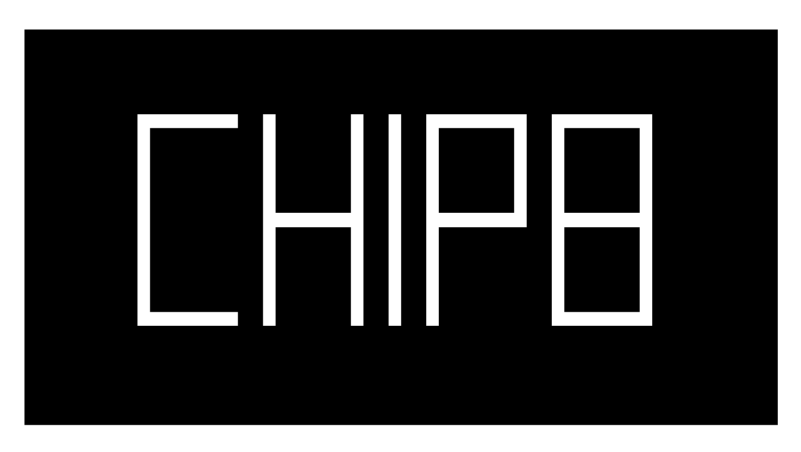
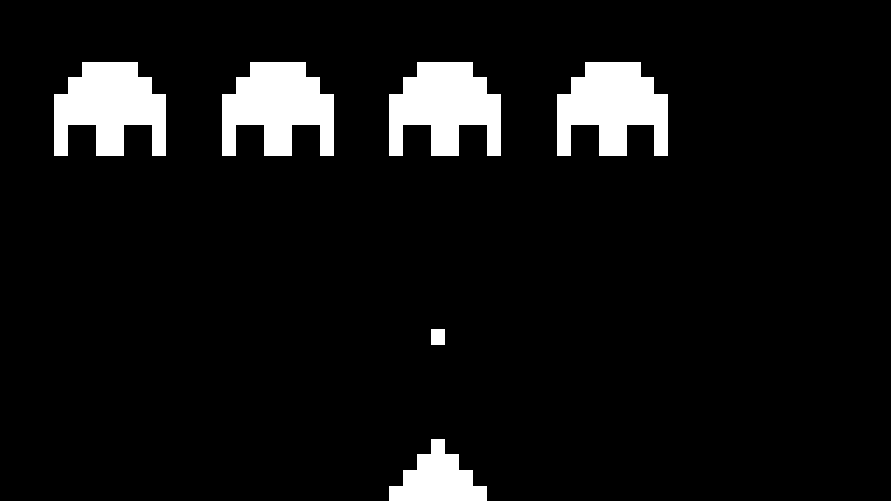
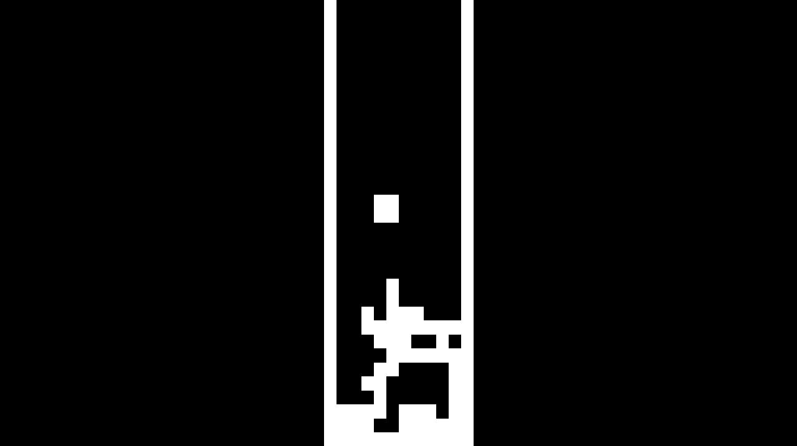
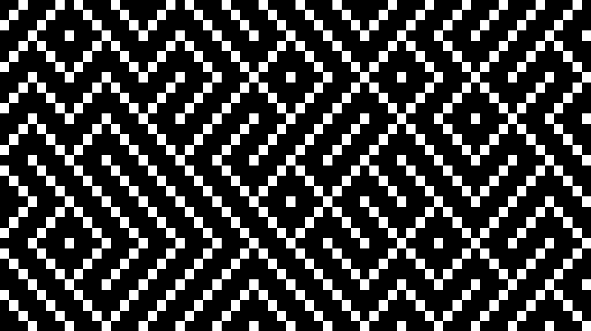

Chip-8 Emulator
=======

## About
Chip-8 emulator/virtual machine written in C++14

## Building

Dependencies
---

* SDL2 (Simple Direct Media Library) is used for rendering and keyboard events

Compiling
---

Simply run  `make all`  
Or under windows `mingw32-make all` if MinGW is installed

## Screenshots

**Space Invaders**
  

**Tetris**
  

**Maze**
  

## TODO:

* Implement remaining SCHIP-48 instructions  
* Graphical user interface
* Sound

***

### By Imanol Fotia - 2018   
<http://www.imanolfotia.com>

